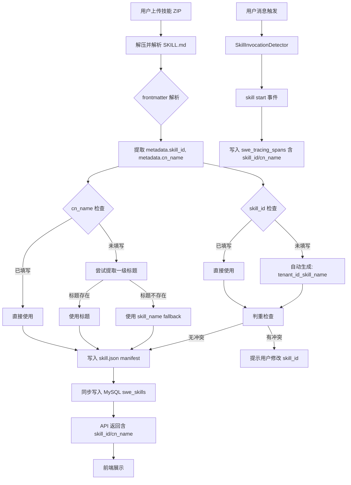
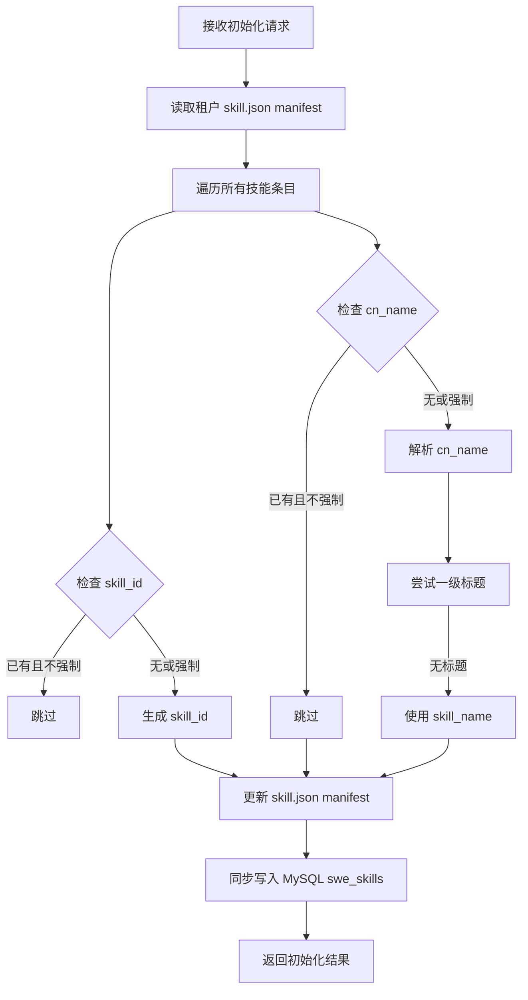

# 技能标识字段新增设计文档

## 概述

在技能与应用市场下，上传技能时新增 `skill_id` 字段和 `cn_name` 字段，用于跨系统同步和界面展示。

## 需求总结

| 需求项 | 详情 |
|--------|------|
| **字段新增** | `skill_id`（唯一标识符）、`cn_name`（中文名） |
| **字段位置** | frontmatter `metadata` 子层 |
| **skill_id 用途** | 跨系统同步唯一标识，前端文本展示（不可编辑） |
| **cn_name 用途** | 界面展示，前端必填输入框 |
| **存储方案** | 新建 MySQL `swe_skills` 表 |
| **追踪埋点** | Span/Trace 模型扩展，数据库表新增字段 |

---

## 1. Frontmatter 字段定义

### 1.1 字段位置

字段放置在 frontmatter 的 `metadata` 子层，避免影响模型对技能的识别：

```yaml
---
name: xlsx
description: "..."
metadata:
  skill_id: "xlsx_001"        # 唯一标识符，可选
  cn_name: "Excel表格处理"    # 中文展示名，必填
  builtin_skill_version: "1.0"
---
```

### 1.2 影响分析

| 影响点 | 分析结果 |
|--------|----------|
| 模型调用 | ✅ 不受影响（agentscope 只读取 `name` 和 `description`） |
| 系统提示注入 | ✅ 不受影响（模板只用 name/description/dir） |
| 技能注册标识 | ✅ 不受影响（目录名作为键） |

### 1.3 解析优先级

**cn_name 解析优先级：**

```
1. metadata.cn_name（frontmatter）
2. SKILL.md 一级标题（如 `# Excel表格处理`）
3. skill_name（技能目录名，作为 fallback）
```

**skill_id 解析优先级：**

```
1. metadata.skill_id（frontmatter）
2. 自动生成：f"{source}_{skill_name}"
```

**注意：** skill_id 不包含 tenant_id，同一技能（相同 source 和 skill_name）在所有租户中共享同一 skill_id。这便于跨系统同步和统计。

**示例：**
- `builtin_xlsx`：内置 xlsx 技能，所有租户共享
- `marketplace_report_generator`：市场分发技能，所有租户共享
- `customized_my_tool`：用户自定义技能（若不同租户创建同名技能，仍共享 ID）

### 1.4 幂等生成规则

**skill_id 自动生成规则：**

```python
skill_id = f"{source}_{skill_name}"
```

示例：
- `builtin_xlsx`
- `marketplace_report_generator`
- `customized_my_tool`

**幂等性保证：**
- 同一来源 + 同一目录名 → 同一 skill_id（跨租户共享）
- 技能内容变化不影响 skill_id（保持稳定）
- 已有技能通过 `skill_name` 判断是否同一技能

---

## 2. 本地存储修改

### 2.1 skill.json manifest 扩展

```json
{
  "skills": {
    "xlsx": {
      "enabled": true,
      "metadata": {
        "name": "xlsx",
        "description": "...",
        "skill_id": "default_xlsx",
        "cn_name": "Excel表格处理",
        "version_text": "1.0.0",
        ...
      }
    }
  }
}
```

### 2.2 代码修改点

| 文件 | 函数 | 修改内容 |
|------|------|----------|
| `skills_manager.py` | `_build_skill_metadata()` | 新增 skill_id、cn_name 字段提取 |
| `skills_manager.py` | 新增 `_extract_cn_name_from_title()` | 从 SKILL.md 一级标题提取中文名 |
| `skills_manager.py` | `_extract_skill_id()` | 提取或生成 skill_id |

---

## 3. MySQL 表设计

### 3.1 swe_skills 表结构

```sql
CREATE TABLE swe_skills (
    id BIGINT AUTO_INCREMENT PRIMARY KEY,
    skill_id VARCHAR(128) NOT NULL COMMENT '技能唯一标识符',
    skill_name VARCHAR(128) NOT NULL COMMENT '技能目录名/运行时标识',
    cn_name VARCHAR(256) NOT NULL COMMENT '中文展示名',
    tenant_id VARCHAR(64) NOT NULL COMMENT '租户ID',
    tenant_name VARCHAR(256) DEFAULT '' COMMENT '租户名称',
    bbk_id VARCHAR(64) DEFAULT '' COMMENT 'BBK标识符',
    source VARCHAR(32) DEFAULT 'customized' COMMENT '来源：builtin/customized/marketplace',
    enabled TINYINT(1) DEFAULT 0 COMMENT '是否启用',
    description TEXT COMMENT '技能描述',
    version_text VARCHAR(32) DEFAULT '1.0.0' COMMENT '版本号',
    signature VARCHAR(64) DEFAULT '' COMMENT '内容哈希',
    created_at DATETIME DEFAULT CURRENT_TIMESTAMP,
    updated_at DATETIME DEFAULT CURRENT_TIMESTAMP ON UPDATE CURRENT_TIMESTAMP,

    UNIQUE KEY uk_skill_id_tenant (skill_id, tenant_id),
    INDEX idx_tenant_skill_name (tenant_id, skill_name),
    INDEX idx_tenant_enabled (tenant_id, enabled),
    INDEX idx_bbk_id (bbk_id),
    INDEX idx_source (source)
) ENGINE=InnoDB DEFAULT CHARSET=utf8mb4 COMMENT='技能注册表';
```

### 3.2 字段说明

| 字段 | 说明 |
|------|------|
| `skill_id` | 唯一标识符，来自 `metadata.skill_id` 或自动生成 `{source}_{skill_name}`，跨租户共享 |
| `skill_name` | 目录名，运行时标识 |
| `cn_name` | 中文展示名，来自解析逻辑 |
| `tenant_id` | 租户隔离 |
| `tenant_name` | 租户名称展示 |
| `bbk_id` | BBK 用户标识关联 |
| `source` | 来源：`builtin`/`customized`/`marketplace` |

**注意：** 同一 skill_id 可能对应多条记录（多个租户拥有同一技能），UNIQUE KEY 为 `(skill_id, tenant_id)`。

### 3.3 同步时机

| 操作 | 同步行为 |
|------|----------|
| 技能创建 | INSERT 到 swe_skills |
| 技能更新 | UPDATE swe_skills |
| 技能删除 | DELETE FROM swe_skills |
| reconcile manifest | 批量同步，增量更新 |

### 3.4 判重逻辑

```python
def check_skill_id_duplicate(skill_id: str, tenant_id: str, skill_name: str) -> str:
    """检查 skill_id 是否重复，返回操作类型"""
    existing = query_skill_by_skill_id(skill_id, tenant_id)
    if existing:
        if existing.skill_name == skill_name:
            return "update"  # 同一技能，允许更新
        else:
            raise ValueError(f"skill_id '{skill_id}' 已被其他技能占用")
    return "create"
```

---

## 4. 追踪模型扩展

### 4.1 Span 模型扩展

**文件：** `src/swe/tracing/models.py`

```python
class Span(BaseModel):
    # ... 现有字段 ...

    # 新增字段
    skill_id: Optional[str] = Field(
        default=None,
        description="技能唯一标识符",
    )
    cn_name: Optional[str] = Field(
        default=None,
        description="技能中文展示名",
    )
```

### 4.2 Trace 模型扩展

```python
class SkillUsageRecord(BaseModel):
    """技能使用记录"""
    skill_id: str
    skill_name: str
    cn_name: str

class Trace(BaseModel):
    # ... 现有字段 ...

    skills_used: list[SkillUsageRecord] = Field(
        default_factory=list,
        description="使用的技能列表",
    )
```

### 4.3 数据库表扩展

**swe_tracing_spans 新增字段：**

```sql
ALTER TABLE swe_tracing_spans
ADD COLUMN skill_id VARCHAR(128) DEFAULT '' COMMENT '技能唯一标识符' AFTER skill_name,
ADD COLUMN cn_name VARCHAR(256) DEFAULT '' COMMENT '技能中文展示名' AFTER skill_id;
```

**swe_tracing_traces：**
- `skills_used` 字段类型为 JSON，存储 `SkillUsageRecord` 列表
- 无需修改表结构，JSON 内容结构更新

### 4.4 写入逻辑修改

**文件：** `src/swe/tracing/manager.py`

| 函数 | 修改内容 |
|------|----------|
| `emit_skill_invocation()` | 新增参数 `skill_id`, `cn_name` |
| `end_skill_invocation()` | skill_output 包含 skill_id、cn_name |

**SkillInvocationDetector 修改：**

| 字段/方法 | 修改内容 |
|-----------|----------|
| `_skill_ids: dict[str, str]` | 缓存 skill_name -> skill_id |
| `_skill_cn_names: dict[str, str]` | 缓存 skill_name -> cn_name |
| `set_enabled_skills()` | 同时缓存 skill_id、cn_name |

---

## 5. API 返回字段扩展

### 5.1 SkillInfo 模型扩展

**文件：** `src/swe/agents/skills_manager.py`

```python
class SkillInfo(BaseModel):
    name: str
    description: str = ""
    version_text: str = ""
    content: str
    source: str
    skill_id: str = ""       # 新增
    cn_name: str = ""        # 新增
    references: dict[str, Any] = Field(default_factory=dict)
    scripts: dict[str, Any] = Field(default_factory=dict)
```

### 5.2 API 响应示例

```json
{
  "skills": [
    {
      "name": "xlsx",
      "description": "...",
      "skill_id": "default_xlsx",
      "cn_name": "Excel表格处理",
      "source": "customized",
      "enabled": true
    }
  ]
}
```

---

## 6. 前端表单设计

### 6.1 表单字段

| 字段 | 类型 | 必填 | 可编辑 | 说明 |
|------|------|------|--------|------|
| `skill_id` | 文本展示 | - | ❌ | 来自 SKILL.md，空时自动生成。提示："来自 SKILL.md 中的 skill_id 字段" |
| `cn_name` | 输入框 | **是** | ✅ | 中文展示名，提示："请输入技能的中文名称，用于界面展示" |

### 6.2 skill_id 展示规则

| 场景 | 展示内容 |
|------|----------|
| frontmatter 有 skill_id | 显示实际值 + 提示"来自 SKILL.md" |
| frontmatter 无 skill_id | 显示自动生成值 + 提示"系统自动生成" |

---

## 7. 数据流图



---

## 8. 实现步骤

### 8.1 代码修改清单

| 序号 | 文件 | 修改内容 |
|------|------|----------|
| 1 | `src/swe/agents/skills_manager.py` | 新增 `_extract_skill_id()`、`_extract_cn_name_from_title()`，修改 `_build_skill_metadata()` |
| 2 | `src/swe/agents/skills_manager.py` | 扩展 `SkillInfo` 模型 |
| 3 | `src/swe/database/` | 新建数据库连接和 swe_skills 表迁移脚本 |
| 4 | `src/swe/tracing/models.py` | Span、Trace 模型新增字段 |
| 5 | `src/swe/tracing/manager.py` | `emit_skill_invocation()` 新增参数 |
| 6 | `src/swe/agents/skill_invocation_detector.py` | 缓存 skill_id、cn_name |
| 7 | `deploy/` | 数据库迁移脚本 |

### 8.2 数据库迁移脚本

**文件：** `deploy/migrations/add_swe_skills_table.sql`

```sql
-- 创建 swe_skills 表
CREATE TABLE swe_skills (...);

-- 扩展 swe_tracing_spans 表
ALTER TABLE swe_tracing_spans ADD COLUMN skill_id ...;
ALTER TABLE swe_tracing_spans ADD COLUMN cn_name ...;
```

### 8.3 测试要点

| 测试项 | 验证内容 |
|--------|----------|
| frontmatter 解析 | skill_id/cn_name 正确提取 |
| 幂等生成 | 同一技能多次生成相同 skill_id |
| 判重逻辑 | 冲突时拒绝，同一技能允许更新 |
| MySQL 同步 | 创建/更新/删除正确同步 |
| 追踪埋点 | Span/Trace 正确包含 skill_id/cn_name |
| API 返回 | 列表接口返回新字段 |

---

## 9. 风险评估

| 风险项 | 影响 | 缓解措施 |
|--------|------|----------|
| 现有技能无 skill_id/cn_name | 数据不完整 | 自动生成逻辑处理，reconcile 时自动填充 |
| skill_id 冲突 | 创建失败 | 判重逻辑 + 提示用户修改 |
| MySQL 同步失败 | 数据不一致 | 同步失败时记录日志，不影响本地存储 |
| 追踪埋点缺失字段 | 统计不完整 | 默认值 fallback，不影响主流程 |

---

## 10. 后续迁移计划

| 时间点 | 迁移内容 |
|--------|----------|
| 当前版本 | skill_name 判断是否同一技能 |
| 后续版本 | 迁移到 skill_id 判断是否同一技能 |

---

## 11. 历史数据初始化接口

### 11.1 接口设计

**API 端点：** `POST /api/internal/skills/init-history`

**功能：** 初始化历史技能数据，填充 skill_id 和 cn_name，同步到 MySQL 表

**请求参数：**

```json
{
  "tenant_id": "default",
  "force": false,
  "dry_run": false
}
```

| 参数 | 类型 | 必填 | 说明 |
|------|------|------|------|
| `tenant_id` | string | 否 | 要初始化的租户 ID，不传时初始化所有租户的技能 |
| `force` | boolean | 否 | 是否强制重新初始化（覆盖已有 skill_id） |
| `dry_run` | boolean | 否 | 试运行模式，仅统计不实际写入 |

**注意：** 同一技能可能被市场分发给多个用户（多租户拥有同一 skill_name），此时每个租户会生成独立的 `skill_id = "{tenant_id}_{skill_name}"`。

**响应示例：**

```json
{
  "success": true,
  "tenant_id": "all",
  "dry_run": false,
  "total_tenants": 3,
  "total_skills": 45,
  "processed": 45,
  "updated_manifest": 20,
  "inserted_db": 45,
  "skipped": 0,
  "errors": []
}
```

### 11.2 初始化流程



### 11.3 实现逻辑

```python
async def init_skill_history_data(
    tenant_id: str | None = None,
    force: bool = False,
    dry_run: bool = False,
) -> dict[str, Any]:
    """初始化历史技能数据

    Args:
        tenant_id: 租户 ID，不传时初始化所有租户的技能
        force: 是否强制重新初始化
        dry_run: 试运行模式，仅统计不实际写入

    Returns:
        初始化结果统计
    """
    results = {
        "tenant_id": tenant_id or "all",
        "dry_run": dry_run,
        "total_tenants": 0,
        "total_skills": 0,
        "processed": 0,
        "updated_manifest": 0,
        "inserted_db": 0,
        "skipped": 0,
        "errors": [],
    }

    # 获取要处理的租户列表
    if tenant_id:
        tenant_ids = [tenant_id]
    else:
        # 初始化所有租户
        tenant_ids = list_all_tenant_ids()

    results["total_tenants"] = len(tenant_ids)

    for tid in tenant_ids:
        # 1. 读取 manifest
        manifest = read_skill_pool_manifest(tid)
        skills = manifest.get("skills", {})
        results["total_skills"] += len(skills)

        # 2. 遍历每个技能
        for skill_name, entry in skills.items():
            try:
                metadata = entry.get("metadata", {})

                # skill_id 处理（基于 source，不含 tenant_id）
                skill_id = metadata.get("skill_id")
                if not skill_id or force:
                    source = entry.get("source", "customized")
                    skill_id = f"{source}_{skill_name}"
                    metadata["skill_id"] = skill_id
                    results["updated_manifest"] += 1

                # cn_name 处理
                cn_name = metadata.get("cn_name")
                if not cn_name or force:
                    # 尝试从一级标题提取
                    cn_name = _extract_cn_name_from_skill_md(skill_dir)
                    if not cn_name:
                        cn_name = skill_name
                    metadata["cn_name"] = cn_name
                    results["updated_manifest"] += 1

                # 更新 manifest（仅在非 dry_run 模式）
                if not dry_run:
                    entry["metadata"] = metadata

                    # 同步到数据库
                    await sync_skill_to_db(
                        skill_id=skill_id,
                        skill_name=skill_name,
                        cn_name=cn_name,
                        tenant_id=tid,
                        entry=entry,
                    )
                    results["inserted_db"] += 1

                results["processed"] += 1

            except Exception as e:
                results["errors"].append({
                    "tenant_id": tid,
                    "skill_name": skill_name,
                    "error": str(e),
                })

        # 3. 保存更新后的 manifest（仅在非 dry_run 模式）
        if not dry_run:
            write_skill_pool_manifest(manifest, tid)

    return results
```

### 11.4 文件数据初始化

对于 SKILL.md 文件中未包含 skill_id/cn_name 的情况：

**方案 A：不修改文件，仅在 manifest 和数据库中记录**
- 保持原始 SKILL.md 不变
- skill_id/cn_name 仅存储在 manifest 和数据库

**方案 B：更新 SKILL.md 文件**
- 自动将 skill_id/cn_name 写入 frontmatter metadata
- 保持文件与 manifest 一致

**推荐方案 A**，理由：
- 不修改原始技能文件，避免意外破坏
- manifest 作为权威数据源

### 11.5 执行方式

| 方式 | 命令/接口 | 说明 |
|------|----------|------|
| CLI 命令 | `swe skills init-history --tenant-id default` | 命令行执行 |
| API 接口 | `POST /api/internal/skills/init-history` | HTTP 接口 |
| 迁移脚本 | `deploy/migrations/init_skill_history.py` | 部署时执行 |

### 11.6 CLI 命令设计

**文件：** `src/swe/cli/skills_cmd.py`

```python
@app.command("init-history")
def init_history_command(
    tenant_id: str = typer.Option(None, help="Tenant ID (default: all tenants)"),
    force: bool = typer.Option(False, help="Force re-initialize"),
    dry_run: bool = typer.Option(False, help="Dry run mode, only count without writing"),
):
    """Initialize historical skill data with skill_id and cn_name."""
    result = asyncio.run(init_skill_history_data(tenant_id, force, dry_run))

    if result["dry_run"]:
        console.print("[yellow]Dry run mode - no actual changes made[/yellow]")

    console.print(f"[green]Successfully processed {result['processed']} skills[/green]")
    console.print(f"  Tenants: {result['total_tenants']}")
    console.print(f"  Total skills: {result['total_skills']}")
    console.print(f"  Manifest updated: {result['updated_manifest']}")
    console.print(f"  Database inserted: {result['inserted_db']}")

    if result["errors"]:
        console.print("[red]Errors:[/red]")
        for err in result["errors"]:
            console.print(f"  - [{err['tenant_id']}] {err['skill_name']}: {err['error']}")
```